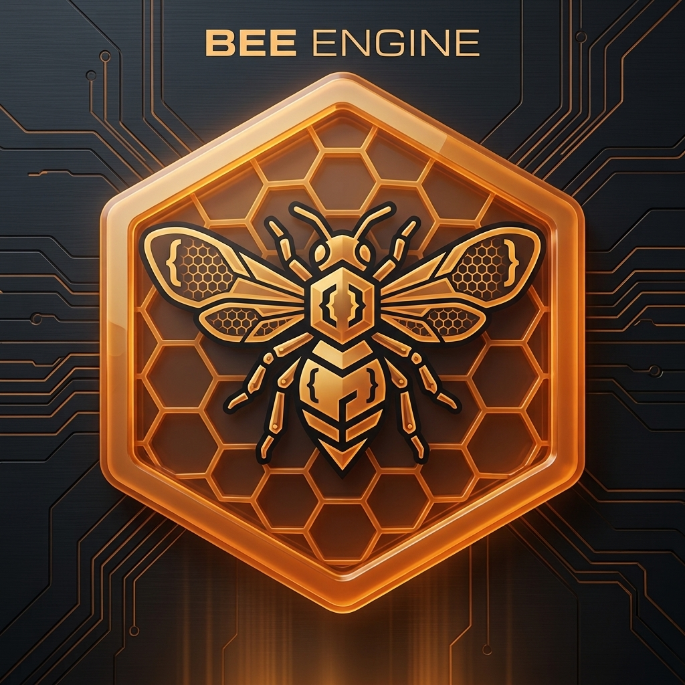

<p align="center">
  
</p>

# 🐝 Motore di gioco 2D BeeEngine (v2.10.0 Professional)

BeeEngine è un motore di gioco 2D leggero, modulare e altamente ottimizzato scritto in puro JavaScript moderno (ES Modules) per HTML5 Canvas.
La **2.10.0** aggiunge il plugin `BeeInventory` (stack, uso, equip, salvataggio degli slot): il motore non lo importa. La **2.9.7** sistema `BeeParticleSystem`: l'AABB segue le particelle vive (niente culling sul 32×32), `update` rispetta `active`/`destroyed`/`dt`, e `destroy` svuota l'array. La **2.9.6** rende `BeeLayer` indipendente dall'ordine delle liste: un figlio con drawLayer proprio non sparisce più se compare prima del padre. La **2.9.5** chiude i bounds di `BeeCamera`: `setBounds` li applica subito, un valore non valido non cancella i limiti già messi, e `Math.round` di x/y non esce dal rettangolo. La **2.9.4** sistema `BeeCamera` da usare (un tick, follow prima del tick, view = canvas). La **2.9.3** allinea `BeeCamera` a `dt` (snap, lerp, bounds, tick nel loop). La **2.9.2** lascia `#pick` decidere durante il lock (coda o interrupt). La **2.9.1** allinea `BeeAnimatedSprite` all'Animator (loop, catch-up, draw). La **2.9.0** apre i plugin: registro cieco + `BeeLocale`. La **2.8.6** sistema `BeePlayer`. La **2.8.5** allinea `BeePlatform.draw`. La **2.8.4** allinea `BeeEnemy.update` a `worldX`. La **2.8.3** rende `BeeMenuScene` un menu configurabile. La **2.8.2** sistema `BeeEnemyShooter`. La **2.8.1** dà a `BeeCollectible` un `collect()` vero. La **2.8.0** chiude il nucleo framework: Animator, Tween/Timeline, AudioMixer, Layer, Prefab, Pathfinder, **BeeUI**. Dalla 2.7: Timer. Dalla 2.6: Pool. Dalla 2.5: Transform, Save, fisica, SceneManager, SpatialHash.


---


<div align="center">
  
  <p><i>Logo Ufficiale BeeEngine</i></p>
</div>

## 📁 Struttura del Progetto Aggiornata

```text
BeeEngine-V2.9/
├── index.html                  # Punto di ingresso HTML e configurazione Canvas
├── index.js                    # Barrel ESM (re-export di BeeEngine.js)
├── main.js                     # Demo visiva (BeeUI: anchor, stack, focus, HUD)
├── BeeEngine.js                # Il CUORE del motore (Core Loop & System Coordinator)
├── README.md                   # Documentazione ufficiale e specifiche tecniche
├── package.json                # Manifest di configurazione per la pubblicazione NPM
├── tsconfig.json               # Configurazione TypeScript per i controlli dell'IDE
├── index.d.ts                  # Definizioni di tipo globali per IntelliSense e TypeScript
├── assets/                     # Gestione centralizzata e ordinata delle risorse
│   ├── audio/                  # Effetti sonori (.mp3) e musiche di sottofondo
│   └── images/                 # Texture dei personaggi (.png), sprite e sfondi
└── src/
    ├── audio/                  # BeeAudioMixer: bus, fade, duck, pan 2D
    ├── core/                   # BeePathfinder, BeePrefab, BeeTween, BeeTimeline, BeePool, BeeTransform, BeeTime, BeeEntity, BeeTimer, scene, asset, save, grid
    ├── gameplay/               # Player, enemy, platform, collectible, menu
    ├── graphics/               # BeeLayer, BeeAnimator, camera, sprite, tilemap, text, particles
    ├── input/                  # Tastiera, mouse, joystick, touch, button
    ├── ui/                     # BeeUI: Control, panel, stack, label, button, nine-slice
    ├── physics/                # BeeSpatialHash, BeePhysicsWorld, BeeRigidBody, AABB groups
    ├── plugins/                # contratto + BeeLocale + BeeInventory (il motore non importa questi file)
    └── debug/                  # BeeLadybug: overlay e hitbox
```

## ⏱ BeeTime (v2.3.0) — orologio di motore

`BeeTime` è l'orologio unico del core loop. Ogni frame fa **un** `tick(timestamp)`; da lì nascono due delta:

| Asse | Campo | Si ferma in pausa? | Segue `timeScale`? | Uso |
| --- | --- | --- | --- | --- |
| Simulazione | `dt` / `elapsed` | sì (`dt = 0`) | sì | fisica, AI, sprite di gameplay, `BeeTimer` di default |
| Reale | `unscaledDt` / `unscaledElapsed` | no | no | HUD, UI, mixer audio, timer di interfaccia |

### Integrazione

Il loop di `BeeEngine` chiama sempre `time.tick`, **renderizza sempre** (anche in pausa) e avanza scene/entità solo se il mondo non è in pausa.

```javascript
import { BeeEngine, BeeTimer } from 'beeengine';

const gioco = new BeeEngine('testCanvas', 800, 600);
gioco.start();

gioco.pause();              // mondo fermo, HUD vivo
gioco.resume();
gioco.setTimeScale(0.25);   // slow-motion
gioco.time.togglePause();

const hudTick = gioco.every(1, () => {}, { unscaled: true });
```

### API essenziale

* `gioco.time.dt` — delta di simulazione (`unscaledDt * timeScale`; 0 in pausa). `maxDelta` (default 50 ms) clamp-a il tempo **reale**, prima della scala.
* `gioco.time.unscaledDt` — delta reale dello stesso frame (vive in pausa).
* `gioco.time.timeScale` — 0.25 / 1 / 2… (clamp 0–16 via `setScale`; il costruttore non clamp-a).
* `gioco.time.begin()` — allinea il timestamp senza azzerare elapsed (start / ripartenza dopo `stop`).
* `gioco.time.fps` — stima su finestra 0.5 s di tempo reale.
* `gioco.time.consumeFixedSteps(fn)` — il loop lo chiama verso `physics.step` (passo 1/60, max 5). Le entity senza `body` restano a dt variabile.
* `gioco.after` / `gioco.every` — timer sul clock del motore (vedi BeeTimer).

Demo visiva: apri `index.html` (via `main.js`). **F2** apre BeeLadybug.

## ⏱ BeeTimer (v2.7.0) — cooldown, non un number a mano

`BeeTime` è l'orologio. `BeeTimer` è l'evento: spawn, cooldown, durata bonus, tick HUD.

`gioco.timers` viene tickato **ogni frame**, anche in pausa. Un timer scalato prende `dt` (si ferma). Uno `unscaled` prende `unscaledDt` (vive). Non passare `dt` e sperare che il flag faccia magie: un numero è uno step esplicito.

```javascript
const ricarica = gioco.after(1.5, () => arma.ready = true);
const hud = gioco.every(1, () => blink = !blink, { unscaled: true });

ricarica.pause();
ricarica.resume();
hud.cancel();
```

| Metodo | Contratto |
| --- | --- |
| `start()` | azzera e parte |
| `pause()` / `stop()` | ferma, tiene `elapsed` |
| `resume()` | riparte senza azzerare |
| `reset()` | azzera il clock, non cambia running |
| `cancel()` | spegne e toglie dal clock |

One-shot: lo stato `finished` si imposta **prima** della callback. Loop: catch-up (max 8 fire a hitch), `duration <= 0` è errore. `BeeEnemyShooter.fire` e il boost temporaneo del player usano questa classe.

## 🎬 BeeAnimator — il grafo, non il clip

<div align="center">
  
  <p><i>`🎬 BeeAnimatedSprite` riproduce un clip. `BeeAnimator` decide **quale** e **quando**.</i></p>
</div>

`BeeAnimatedSprite` riproduce un clip. `BeeAnimator` decide **quale** e **quando**: idle → run → jump, priorità, lock del colpo. Lo sprite resta il renderer. `entity.animator` viene tickato nel loop entity (dt di simulazione: in pausa il clip si ferma). Senza animator, `BeeEntity.update` ticka `entity.sprite` — niente primo frame eterno, niente doppio update se l'animator c'è.

L'Animator è fonte di verità sul loop: `#enter` chiama `sprite.play(clip, { restart: true, loop: next.loop })`. `play` con `loop` booleano sovrascrive `anim.loop` solo per quel play; senza opzione resta il clip. One-shot: ultimo frame + `finished: true`, il timer non accumula. `dt` enorme: al massimo 4 frame di ritardo in `timer`, **un** avanzamento per `update`. `fps` 0 / non numerico cade su 8. `draw` esce se manca `ctx` o i frame, e `restore()` gira sempre.

```javascript
const sprite = gioco.createAnimatedSprite(sheet, {
    animations: {
        idle: { frames: [0, 1], fps: 4, loop: true },
        run: { frames: [2, 3, 4, 5], fps: 10, loop: true },
        attack: { frames: [6, 7, 8], fps: 12, loop: false }
    }
});

const animator = gioco.createAnimator(sprite);
animator
    .add('idle', { clip: 'idle', initial: true })
    .add('run', { clip: 'run', priority: 1 })
    .add('attack', { clip: 'attack', loop: false, lock: true, priority: 10, exitTo: 'idle' })
    .when('idle', 'run', (actor) => Math.abs(actor.vx) > 1)
    .when('run', 'idle', (actor) => Math.abs(actor.vx) <= 1)
    .when('*', 'attack', (actor) => actor.wantsAttack)
    .start();

actor.sprite = sprite;
actor.animator = animator;
```

| Contratto | Significato |
| --- | --- |
| `lock` | finché il clip non è `finished`, gli **stati** con priorità ≤ non interrompono (vanno in coda). `#pick` gira anche sotto lock: priorità alta interrompe, bassa accoda |
| `exitTo` | dove andare a clip finito (one-shot / lock) |
| `when('*', to, pred)` | da qualsiasi stato |
| `play(name, { force })` | richiesta manuale; `force` rompe il lock |
| `onComplete` | una volta per ingresso nello stato, non ogni frame con `finished` |


`BeeAnimatedSprite.play` ritorna `true`/`false` (clip assente: `false` + `console.warn`). Se uno stato `lock:true` parte senza sprite, o `play` fallisce, l'Animator avvisa: resta bloccato, non è un unlock silenzioso.

Scelte di design (non bug): il primo `add()` è `initial` di default; `#queued` è uno slot solo; `set()` / `when()` su nomi sbagliati o stati non ancora registrati restano silenziosi.

Demo: `examples/anim.html` — spazio one-shot, X attacco (`wantsAttack` si spegne in `onEnter`, come `consumeAttack`), H hitch. Test: `node scripts/test-beeanimator.mjs` e `node scripts/test-beeanimatedsprite.mjs`.

## 📷 BeeCamera — dt, non un lerp per frame


<div align="center">
  
  <p><i>BeeCamera in azione: il mondo scorre con la telecamera mentre la BeeUI mantiene l'HUD fisso in spazio schermo.</i></p>
</div>


`follow(target)` **tiene** il bersaglio. Il loop, se è `gioco.camera` e c’è un target, chiama **una volta** `update(dt)` **dopo** scene / entity / `gioco.update` e **prima** di `apply`. Non chiamare `camera.update` a mano: due chiamate = due lerp. `follow` in `scene.update` (o una volta in `enter`) va bene. In `gioco.update` ora prende lo stesso frame; prima il tick stava prima e perdevi un frame.

Centro: `worldX`/`worldY` se sono numeri, senno `x`/`y`. `width`/`height` mancanti valgono 0, non NaN. `smooth <= 0` o `>= 1` è snap (è il contratto: `follow(target, 0)` aggancia subito). Tra 0 e 1 è lerp su `dt` (stesso feeling a 30 e 60 fps). `dt` 0 / pausa → non segue il target; se x/y sono fuori dai bounds, li riporta sul bordo. Costruttore: w/h numerici, altrimenti 800×600. Target `destroyed` o `follow(null)`: non avanza, i bounds restano. `setBounds` clamp-a prima di tornare. Un numero non finito o un lato negativo non tocca i bounds già impostati (`setBounds(null)` li toglie).

`enableAutoResize` scala solo il **CSS**. Il view è `canvas.width`/`height`; il motore allinea `camera.w`/`h` a quello (letterbox ≠ mondo più grande). `screenToWorld` / `worldToScreen` usano lo stesso `Math.round` di `apply`.

```javascript
gioco.camera = gioco.createCamera(800, 600);
gioco.camera.setBounds(0, 0, 1600, 900);
gioco.camera.follow(hero, 0.08); // scene.update o enter — niente camera.update()
```

| Contratto | Significato |
| --- | --- |
| `follow` / `update` / `apply` / `setBounds` / `setSize` | tornano `this` |
| `gioco.camera` + target | il loop ticka; `update()` a mano è no-op |
| `apply` senza `ctx` | esce, non lancia |
| bounds più stretti del view | centra sul bounds, non inverte il clamp |
| `setBounds(null)` | toglie i limiti |
| `setBounds` con numeri non validi | non cambia i bounds (niente azzeramento) |
| bordo dei bounds | `Math.round(x/y)` resta dentro il lato, come `apply` |
| `getViewBounds` / `isRectVisible` | stesso `Math.round` di `apply` (niente sfasamento 1px con tilemap) |

Niente zoom / shake / deadzone in questo giro. Test: `node scripts/test-beecamera.mjs`.

## 🔊 BeeAudioMixer — bus, non cloneNode

`playSound` / `playMusic` erano one-shot e un loop. `gioco.audio` è il grafo: **master / music / sfx / ui / voice**, volume e mute per canale, fade, ducking della musica quando parla `voice`, pan 2D rispetto al listener (centro camera o canvas). Il mixer ticka ogni frame sul tempo reale.

```javascript
gioco.audio.unlock();                    // gesto utente
gioco.audio.music(track, { fade: 0.6, volume: 0.5 });
gioco.audio.play('hit', { bus: 'sfx', x: 120, y: 300 });
gioco.audio.tone({ frequency: 180, duration: 1.1, bus: 'voice' }); // duck
gioco.audio.setVolume('sfx', 0.8);
gioco.audio.fade('music', 0.2, 0.4);
```

| Contratto | Significato |
| --- | --- |
| `bus` | catena verso master; mute sul padre zittisce i figli |
| `duck` | default: `voice` abbassa `music` (amount 0.35) |
| `x, y` | attenuazione + pan vs listener |
| `tone()` | beep procedurale (demo senza mp3) |

`playSound` / `playMusic` restano, ma passano dal mixer.

## 🎞 BeeTween + BeeTimeline — interpolare proprietà, non un cooldown

`BeeTimer` conta i secondi. `BeeTween` **scrive** `x`, `alpha`, `scaleX`, `volume` ogni frame, con easing. `BeeTimeline` mette tween, attese e callback in sequenza (o in parallelo con `at`).

`gioco.tweens` ticka ogni frame come i timer: scalato in pausa si ferma, `unscaled: true` no. `entity.alpha` (default 1) è applicato in `drawEntity`.

```javascript
gioco.to(box, { x: 640, alpha: 1 }, { duration: 0.6, ease: 'backOut' });

const cut = gioco.timeline()
    .to(logo, { scaleX: 1, scaleY: 1 }, { duration: 0.4, ease: 'backOut' })
    .wait(0.15)
    .to(logo, { y: 80 }, { duration: 0.35, ease: 'quadOut' })
    .to(panel, { alpha: 1 }, { duration: 0.3, at: 0.2 })
    .call(() => ready = true)
    .start();
```

`.to(a, { duration: 1 }).to(b, { duration: 1, at: 5 }).to(c, { duration: 1 })` — `c` parte a **t = 2** (coda fluent di `a`+`b`), non a t = 6. `at` piazza solo quell'item.

| API | Contratto |
| --- | --- |
| `gioco.to` / `from` / `fromTo` | un tween, overwrite sulle stesse chiavi |
| `ease` | nome (`quadOut`, `backOut`, `bounceOut`…) o funzione `t => t` |
| `yoyo` + `repeat` | andata/ritorno; ogni ciclo senza yoyo riparte dallo snapshot iniziale (non dalla posa finale). `repeat: Infinity` = loop |
| `timeline().to(..., { at })` | `at` è tempo assoluto di quell'item; il cursore di coda per il prossimo `.to()` senza `at` resta in serie |
| `timeline().call(fn, at)` / `set(target, props, at)` | marker a durata 0: allungano `duration` almeno fino ad `at` (anche su timeline vuota) |
| `gioco.tweens.kill(target)` | spegne i tween su quell'oggetto |

Limiti accettati (non sono bug): `onComplete` del tween figlio **non** scatta durante `seek()` — usa `call()` o `timeline.onComplete`. Il residuo di `dt` oltre la fine del ciclo non viene recuperato (nessun catch-up).


## 🖼 BeeLayer — pipeline di disegno, non l'array di entity

Oggi l'ordine non è più «come stanno nell'array». `gioco.layers` è la pipeline: **background → world → ysort** in spazio mondo (sotto la camera), poi **ui** in spazio schermo *dopo* `restore`. HUD e mondo non condividono lo stesso passaggio.

`BEE_LAYER` (fisica) è un bitmask. `BeeLayer` / `BEE_DRAW` sono pass di render. Non mescolarli.

```javascript
entity.drawLayer = BEE_DRAW.YSORT;   // personaggi, alberi
label.drawLayer = BEE_DRAW.UI;       // BeeText è già ui
gioco.layers.add('fx', { space: 'world', sort: 'stable', order: 25 });
```

Y-sort usa i piedi (`y + height`) o `entity.sortY`. A parità di Y l'ordine di raccolta resta stabile (chi è stato raccolto prima resta sotto).

| API | Contratto |
| --- | --- |
| `BEE_DRAW.BACKGROUND / WORLD / YSORT` | spazio mondo, camera applicata |
| `BEE_DRAW.UI` | spazio schermo, dopo la camera. Culling sul canvas, non sul frustum |
| `sort: 'stable'` | ordine di raccolta, nessun shuffle |
| `sort: 'y'` | piedi, poi indice (stabile) |
| `scene.drawWorld` | sfondo mondo, prima delle entity, sotto la camera |
| `scene.draw` | solo HUD, dopo `restore` — non un secondo `for` sulle entity |
| figlio con altro `drawLayer` | esce dal parent e va nel suo pass (UI figlia di un actor) |

Limite: i figli *senza* `drawLayer` proprio si disegnano col parent (cappello sull'head), non vengono y-sorted da soli.

## 🧱 BeePrefab — fabbrica da dati, non `new` sparso

Livelli, wave e oggetti tilemap istanziamo **la stessa ricetta** con override (`x`, `y`, `hp`). `new BeeEnemy(...)` resta nella factory del tipo, non nel gioco.

`gioco.prefabs` è già sull'engine. Tipi pronti: `entity`, `enemy`, `player`, `shooter`, `platform`, `collectible`, `text`. `gioco.spawn(name)` è il **pool**. `gioco.prefabs.spawn(name)` è la ricetta.

```javascript
gioco.prefabs.define('slime', {
    type: 'enemy',
    width: 32,
    height: 32,
    speed: 45,
    hp: 3,
    sprite: 'slime',
    collider: true,
    drawLayer: 'ysort',
    patrol: { minX: 80, maxX: 400 }
});

gioco.prefabs.spawn('slime', { x: 220, y: 348 });
gioco.prefabs.spawnMany('slime', [[100, 80], [180, 80], { x: 260, y: 80, hp: 1 }]);
gioco.prefabs.fromList([{ prefab: 'slime', x: 10, y: 20 }, { prefab: 'drone', x: 40, y: 20 }]);
gioco.prefabs.fromObjects(map.layers[2].objects); // Tiled: type/name/properties
```

`extend` eredita un'altra ricetta. `setup(entity, spec, engine)` è l'ultimo gancio. I campi custom stanno in `props`. Spawn **non** muta la ricetta.

| API | Contratto |
| --- | --- |
| `type(name, Class\|fn)` | registra come si costruisce quel tipo |
| `define(name, spec)` | ricetta; sovrascrive se lo stesso nome |
| `spawn(name, override)` | istanza nuova; `addToScene` default true |
| `spawnMany` / `fromList` | wave / livello da array |
| `fromObjects` | oggetti Tiled; tipi senza ricetta si saltano (salvo `strict`) |
| `collider: true` | `addRectCollider()` |
| `children` | prefab annidati, non aggiunti di nuovo alla scena |

`BeePool` è il riuso GC. `BeePrefab` è il template. Si possono combinare con `pool: 'enemy'` sulla ricetta (acquire + apply).

## 🎁 BeeCollectible — raccogliere, non solo cadere

Cade a `speed` fissa su **`worldY`** (non `y` locale). Fuori dallo schermo in basso: `reset()` in cima. Toccare il player non fa nulla da solo — la scena chiama `collect(collector)`.

```javascript
if (player.collidesWith(item)) item.collect(player);
// oppure
gioco.collisions.overlap('player', 'loot', (p, item) => item.collect(p));
```

`collect` è no-op se `destroyed` o `!active`. Chiama `onCollect(item, collector)` e poi `destroy()` (release se pooled, teardown altrimenti). `gravity`/`vx`/`vy` restano a 0: il moto è solo `speed`, `integrate()` non lo muove. `recycle()` esiste come hook di pool; oggi è vuoto perché `reset()` rigenera già posa e velocità all'`acquire`.

## 👾 BeeEnemy — patrol su `worldX`, muro vero

`update` esce se `destroyed` / `!active`. Cammina su **`worldX`**, non `x` locale. `setPatrolBounds(minX, maxX)` è AABB: a destra `worldX + width`, non il bordo sinistro dello sprite. Oltre il limite: clamp + inversione di `speed`. Il moto è solo `speed` — non accendere `vx`/`gravity` insieme.


## 🟫 BeePlatform — sprite, non un collider

<div align="center">
  
  <p><i>🟫 BeePlatform: Sprite statico per i solidi: color / textureKey, la fisica sta su collisions.solid</i></p>
</div>

Rettangolo o texture. La solidità **non** vive sulla classe: la scena fa `collisions.solid('player', 'solids')` e il mover chiama `resolvePlatformCollision`. `draw` fa `save`/`restore` e chiama `getAsset` solo se esiste.

Demo: apri `examples/platform.html` (WASD / frecce, spazio per saltare).


## 🧍 BeePlayer — platformer / free, non un sasso senza input

<div align="center">
  
  <p><i>🧍BeePlayer: Senza 'input' la fisica gira lo stesso</i></p>
</div>

Senza `input` la fisica gira lo stesso (`integrate`, gravità, figli). Solo `destroyed` / `!active` escono. `setMode('free')` mette `gravity = 0`; `setMode('platformer')` la rimette a 500. Non assegnare `this.mode` a mano.

`consumeAttack()` legge e spegne `wantsAttack` (X/J). Chiamalo in **`scene.lateUpdate`** (dopo il tick entity dello stesso frame), non in `scene.update`. `boostJump` è permanente; `boostJumpTemporary` copre e allo scadere torna al permanente, non a `baseJumpForce` secco. In prefab `mode: 'free'` vince su un eventuale `gravity` nella stessa ricetta (`setMode` è applicato dopo).

`draw` avvolge sprite/texture/rettangolo in `save`/`restore`.

Limiti d'uso (non bug): `takeDamage` non ha invulnerabilità; il salto in platformer funziona se `collisions.run()` gira **prima** dell'update entity (come la demo); `potenziaSalto*` sono solo alias.

Demo: `examples/player.html` — F cambia modalità, X attacca.

## 🔫 BeeEnemyShooter — rimbalzo clampato, non flip del segno

`update` esce se `destroyed` / `!active`. Rimbalza su `worldX`/`worldY` dentro `setBounds` (se manca, il canvas). Oltre il bordo: clamp + `Math.abs` sulla velocità — niente jitter. Il moto è `vx`/`vy`; `speed` resta 0 così il patrol locale di `BeeEnemy` non si somma.

`shoot()` mette il proiettile in `bulletGroup` (default `'hazards'`) via `collisions.add`. Fermato (`vx === vy === 0`) spara in giù, non in su. In pool: `recycle()` cancella `fire`, `reset()` fa `fire.start()` (stesso `BeeTimer`, niente new).

## 🧭 BeePathfinder — A* e flow field, non chase in linea retta

`gioco.pathfinder` cammina su `BeeGrid` / `BeeTilemap`. 0 è camminabile (o `walkable` custom). I solidi della tilemap usano `isSolidTile`. `setBlocked` aggiunge ostacoli runtime (porte, corpi) e invalida i path. `track` ricalcola solo se cambiano goal o versione.

```javascript
gioco.setGrid(new BeeGrid(25, 18, 32));
const nav = gioco.pathfinder;
nav.useTilemap(mappa);          // oppure useGrid / useCells

const path = nav.find(hunter, target);
nav.follow(hunter, path, dt, hunter.speed);
nav.chase(hunter, target, dt);  // track + follow, path su hunter.path

nav.flow(target);               // un goal, tanti agenti
const dir = nav.sampleFlow(agent);
```

Diagonale octile, **niente taglio angolo** (`cornerCut: false`): non si passa tra due muri in diagonale. Fuori mappa = solido. Il goal su una cella bloccata → `found: false`. Lo start sì (l'agente è già lì).

| API | Contratto |
| --- | --- |
| `find` / `findCells` | A* → `BeePath` (celle + punti mondo al centro) |
| `track` | riusa il path se goal e muri sono gli stessi |
| `follow` | avanza i waypoint, scrive `worldX/Y` |
| `chase` | inseguimento; ricalcola se il target cambia cella |
| `flow` / `sampleFlow` | campo verso un goal (wave / stormo) |
| `setBlocked(c, r)` | ostacolo extra, bump `version` |

Limite: non è steering con raggio. Un agent più grosso di una cella va trattato con celle “inflate” (blocca i vicini) — non lo fa da solo.

## 🖥 BeeUI — Control, non un bottone su canvas

`gioco.ui` è un albero in **spazio schermo**, dopo `restore` della camera. Vive in pausa. Ancoraggi tipo Godot `Control` / uGUI: frazioni 0–1 + offset in pixel. `BeeButton` resta il widget legacy su entity; i menu nuovi usano `BeeUIButton`.

```javascript
const ui = gioco.ui;
ui.add(new BeeLabel({ text: 'SCORE', anchor: BEE_ANCHOR.TOP_LEFT, x: 16, y: 16, width: 200, height: 28 }));
ui.add(new BeeLabel({ text: 'HP', anchor: BEE_ANCHOR.TOP_RIGHT, x: 16, y: 16, width: 120, height: 28 }));

const menu = new BeeStack({
    anchor: BEE_ANCHOR.CENTER,
    background: 'rgba(8,10,18,0.92)',
    image: sliceSkin,
    slice: { left: 8, top: 8, right: 8, bottom: 8 }
});
menu.add(new BeeUIButton({ text: 'Riprendi', onClick: () => gioco.resume() }));
menu.add(new BeeUIButton({ text: 'Lento', onClick: () => gioco.setTimeScale(0.25) }));
ui.add(menu);
```

Tab / Shift+Tab, frecce (o WASD), Enter/Space, D-pad e A del gamepad. Focus con bordo. Nine-slice: `drawNineSlice` + `panel.image` / `panel.slice`.

| API | Contratto |
| --- | --- |
| `anchor(preset, { x, y, width, height, margin })` | `topLeft` / `topRight` / `center` / `full` / lati |
| `BeeStack` | `v` o `h`, gap, padding; i figli non usano l'array mondo |
| `BeePanel` | fill, bordo, nine-slice |
| `focusNext` / `focusToward` | anello dei `focusable` visibili |
| `update` | ogni frame, anche in pausa, prima di `input.endFrame` |

Limite: non è HTML/DOM. Niente input text nativo, scroll view o flex wrap — quelli sono plugin.

## 🔌 Plugin — registro cieco (2.9.0)

Il motore **non importa** i plugin. Contratto in `src/plugins/PLUGIN_CONTRACT.md`: `attach` / `detach`, `registerPlugin` / `unregisterPlugin`. Se serve un frame: `engine.onTick(fn)`, mai `loop()` né sovrascrivere `update`.

```javascript
import { BeeEngine } from 'beeengine';
import { BeeLocale, BeeInventory } from 'beeengine/plugins';

const gioco = new BeeEngine('testCanvas', 800, 600);
const locale = new BeeLocale({
    language: 'it',
    fallback: 'en',
    strings: {
        it: { play: 'Gioca' },
        en: { play: 'Play', hint: 'Press start' }
    }
});
locale.attach(gioco);
locale.t('play');   // Gioca
locale.t('hint');   // Press start (fallback)
locale.t('ghost');  // ghost (chiave visibile, non "")

const inventory = new BeeInventory({ slots: 1, equipSlots: ['hand'], engine: gioco });
inventory.defineItem('potion', {
    name: 'Pozione',
    maxStack: 5,
    consumable: true,
    onUse: () => true
});
const drop = inventory.add('potion', 8); // { added: 5, left: 3 }
inventory.use(0, null);
```

`BeeLocale` è pura lettura. Chi disegna chiama `t(key)`. `BeeInventory` non disegna e non entra nel loop: `add` dice sempre cosa non è entrato (`left`), `equip` / `unequip` o riescono per intero o lasciano lo stato com'era. Le definizioni restano nel codice; `toJSON` salva solo slot ed equipaggiamento. Demo: `examples/inventory.html` (collectible + conteggi via `BeeLocale.t`). Test: `node scripts/test-beeinventory.mjs`. Prossimi (uno alla volta): Light, Dialogue, Quest, Net, Post, Spine.

## 🎬 BeeSceneManager — replace, non stack

`change` sostituisce la scena. Stesso nome = restart (`onExit`/`exit` → sweep entity → `onEnter`/`enter`). Non è uno stack: niente push/pop/fade.

Il manager è l’unico owner del **tick** entity. Il **disegno** delle entity è di `BeeLayer`. `scene.drawWorld` è lo sfondo mondo; `scene.draw` è HUD.

| API | Contratto |
| --- | --- |
| `add(name, scene)` | registra; `add(null)` lancia |
| `change(name, data)` | replace + restart; `change` dentro `update` slitta le entity al frame dopo |
| `scene.lateUpdate` | dopo il tick entity dello stesso frame (`consumeAttack`, reazioni) |
| `remove(name)` | sweep + toglie dalla Map |
| `persistEntities: true` | uscire non distrugge le entity |
| `gioco.addEntity` | se c’è una scena corrente, va lì, non in `engine.entities` |

`gioco.setScene(name)` chiama `destroy()` su ogni voce di `engine.entities` (body esce dal world; pooled torna in pila), poi svuota l’array e fa `scenes.change`. Senza quel ciclo il body restava nel world — leak silenzioso.

`engine.destroy()` chiama `scenes.destroy()` (exit della corrente, sweep di tutte, Map vuota). Stacca resize e unlock audio. **Non** stacca `BeeInput` (keydown/mouse/touch restano su `window`/`canvas`): va bene se il motore vive per tutta la pagina; non ricreare più istanze sulla stessa pagina senza un teardown input dedicato.

`enableAutoResize` sostituisce l’handler precedente: due chiamate non accumulano listener `resize`.

## 📋 BeeMenuScene — menu, non splash verso `'game'`

Scena riusabile: `enter` / `exit` / `update` / `draw`. Il target non è mai hardcodato.

```javascript
gioco.scenes.add('menu', new BeeMenuScene({
    title: 'BEE ENGINE',
    subtitle: 'PLATFORM & ACTION',
    next: 'main',
    items: [
        { label: 'Gioca', next: 'main' },
        { label: 'Esci', onSelect: () => window.close() }
    ]
}));
```

Senza `items`: Invio / Spazio / click → `next` o `onStart(engine)`. Con `items`: frecce / WASD, conferma, click sulla voce. `draw` fa `save`/`restore`. Il blink usa `engine.time.elapsed`, non `Date.now()`. Senza engine: `console.warn`, non no-op muto.

Il loop **non** chiama `scenes.update` in pausa. Un menu + `engine.pause()` è schermo fermo — non è un bug della scena, è il contratto del loop.

## 🧭 BeeTransform (v2.5.0) — scena grafo affine

<div align="center">
  
  <p><i>🧭 BeeTransform è la geometria.</i></p>
</div>

`BeeTransform` è la geometria. `BeeEntity` ne possiede una (`entity.transform`) e non ricalcola più il mondo come somma di offset.

Matrice locale: `T(pos) · R · S · T(-pivot)`.  
Matrice mondo: `parent.world · local`. Cache dirty-flag, zero allocazioni nel tick.

| Locale | Mondo |
| --- | --- |
| `x`, `y`, `rotation`, `scaleX/Y`, `pivotX/Y` | `worldX/Y`, `worldRotation`, `worldScaleX/Y` |
| `setPivot` / `setPivotNormalized` | `setWorldOrigin` (inverte la catena, non sottrae) |
| `applyWorldTo(ctx)` | disegna in spazio locale |

```javascript
hub.transform.setPivot(36, 36);
hub.angularVelocity = 0.8;
hub.addChild(satellite);          // satellite.x/y restano locali
ctx.save();
entity.applyWorldTransform(ctx);
ctx.fillRect(0, 0, entity.width, entity.height);
ctx.restore();
```

`getWorldAABB()` è l'AABB dell'OBB ruotato: Ladybug disegna i quattro spigoli, il culling usa i bounds giusti.

## ⚖ BeeRigidBody + BeePhysicsWorld — corpo e mondo, non AABB a gruppi

<div align="center">
  
  <p><i>⚖ BeeRigidBody + BeePhysicsWorld gravità di scena, massa, impulsi.</i></p>
</div>

`BeeEntity` resta dati. `BeeTransform` resta geometria. La fisica vive in `gioco.physics` (`BeePhysicsWorld`): gravità di scena, massa, impulsi, layer/mask, forme box/cerchio/capsula. `BeeCollisionSystem` **non** è questo: è ancora il risolutore AABB a gruppi per il platformer.

Il loop chiama `time.consumeFixedSteps` → `physics.step`. Se l'entità ha un `body`, `integrate()` non si muove da sola.

| Layer | Uso tipico |
| --- | --- |
| `BEE_LAYER.WORLD` | pavimento, muri |
| `BEE_LAYER.PLAYER` | corpi dinamici di gameplay |
| `BEE_LAYER.TRIGGER` | sensor: `isTrigger`, niente bounce |
| `BEE_LAYER.GHOST` | il player lo ignora se non è nel `mask` |

```javascript
const body = entity.addRigidBody({
    world: gioco.physics,
    type: 'dynamic',
    mass: 2,
    shape: BeeRigidBody.circle(18),
    layer: BEE_LAYER.PLAYER,
    mask: BEE_LAYER.WORLD | BEE_LAYER.PLAYER | BEE_LAYER.TRIGGER
});
body.applyImpulse(0, -420);

gioco.physics.gravityY = 980;
gioco.physics.onBeginOverlap = (a, b) => { /* trigger o sensor */ };
```

Click in demo: impulso verso il puntatore. F2 Ladybug disegna la forma del body, non solo il rettangolo.

## 🗺 BeeSpatialHash — chi è vicino a questo AABB?

Le coppie n² esplodono con decine di proiettili. `BeeSpatialHash` è un indice a celle (non un quadtree: i body di gameplay hanno taglia simile, l'hash è più stabile). `gioco.physics.hash` si ricostruisce ogni `step`. `gioco.spatial` è lo stesso indice, per i query di gioco.

```javascript
const hits = gioco.physics.queryRadius(x, y, 80);
for (let i = 0; i < hits.length; i++) {
    hits[i].applyImpulse(0, -300);   // esplosione
}
```

`BeeCollisionSystem` e Ladybug usano lo stesso broadphase. Cella default 64px (`cellSize`).

## ♻️ BeePool (v2.6.0) — spawn/release, non create/destroy

Create/destroy di bullet e particelle è il hitch GC più comune in Canvas. `BeePool` prealloca, `acquire`/`release`, resetta lo stato. Se il pool è pieno, riutilizza il più vecchio ancora in uso (`reclaim`). `entity.destroy()` su un oggetto pooled lo rimette in pila: non smonta transform/body.

`gioco.bullets` è il pool di default (32 prewarm, max 256). `BeeEnemyShooter` lo usa. `BeeParticleSystem` ha un pool interno (`particlePool`) e compatta l'array live senza `filter`. `getWorldAABB` racchiude le particelle vive (centro ± `size`); senza particelle il lato è 0, così `drawEntity` non le scarta sul box 32×32 dell'entity. `emit` con count non valido o sistema `destroyed` non acquisisce. `dt` non finito o `<= 0` non le muove. `destroy` / `dispose` svuotano pool e array. Test: `node scripts/test-beeparticlesystem.mjs`.

```javascript
const colpo = gioco.bullets.acquire(x, y, 0, 280, 10, 10);
gioco.addEntity(colpo);
colpo.destroy();   // release, non teardown

const fx = new BeeParticleSystem({ x, y, initial: 64, max: 256 });
fx.emit(24, { color: '#ffcc66' });

gioco.createPool('spark', {
    create: () => ({ life: 0 }),
    reset: (item, life) => { item.life = life; },
    initial: 16,
    max: 64,
    reclaim: false
});
```

| Campo | Significato |
| --- | --- |
| `available` | oggetti dormienti in pila |
| `inUse` | oggetti vivi |
| `size` | available + inUse (non cresce oltre `max`) |

`gioco.spawn('bullet', x, y, vx, vy)` = acquire + `addEntity`.

## 💾 BeeSave — persistenza DTO, non `setItem` nudo

`BeeSave` non è più una facade cieca su `localStorage`. Ogni record è un envelope `{ __bee, v, t, d }`. `read()` distingue **missing / ok / corrupt / unavailable / rejected / quota**. Un JSON rotto non è un primo avvio.

| Metodo | Significato |
| --- | --- |
| `read(key)` | record onesto: usa questo per i progressi |
| `load(key, fallback)` | valore se `ok` (anche `null` salvato); missing → fallback |
| `exists(key)` | record **valido**; un blob corrotto è `false` |
| `has(key)` | chiave presente sul disco, anche se rotta |
| `configure({ namespace, version, migrate })` | una volta all'avvio: isola i denti sullo stesso dominio |

```javascript
gioco.save.configure({ namespace: 'orbit', version: 2, migrate(data, from) {
    if (from < 2) return { score: data.score ?? 0, lives: 3 };
    return data;
}});

const slot = gioco.save.readSlot(0);
if (slot.status === 'missing') { /* primo avvio */ }
if (slot.status === 'corrupt') { /* ripara o wipe, non trattarlo come new game */ }
if (slot.ok) { apply(slot.value); }

gioco.save.save('settings', { muted: true });   // DTO piatto
// BeeSave.save('p', player) → rejected: niente entità vive
```

Safari privato / storage assente: fallback in memoria di sessione (`fallback: 'memory'`). `save` non lancia. I record pre-envelope restano leggibili come `legacy`.


## 🐞 BeeLadybug (v2.4.0) — debug visivo e monitoraggio

<div align="center">
  
  <p><i>🐞 BeeLadybug: l'occhio del motore</i></p>
</div>

`BeeLadybug` è l'occhio del motore: non è una classe di gameplay. Vive in `src/debug/` e disegna **dopo** il mondo (hitbox in spazio camera, overlay in spazio schermo).

### Perché F2

* **F12** è DevTools del browser: non lo tocchiamo.
* La **tilde** sui layout italiani non è un tasto unico.
* **F2** è libero, ed è lo standard dei pannelli debug nei motori.

### Cosa mostra

* Hitbox AABB di ogni entità (scene + `engine.entities` + figli + gruppi di collisione). Se l'entità ha un `BeeTransform`, Ladybug traccia anche l'OBB (i quattro spigoli ruotati).
* **Verde** = attiva, **rosso** = in overlap con un'altra AABB, **grigio** = inattiva.
* Overlay: FPS (`BeeTime.fps`), entità attive / in memoria, durata ciclo (`unscaledDt` in ms), `timeScale`, stato RUN/FREEZE.

### Controlli

| Tasto | Azione |
| --- | --- |
| F2 | mostra / nasconde la coccinella |
| F3 | alterna slow-motion `0.25x` e `1x` |
| F4 | freeze / unfreeze della simulazione (`BeeTime.pause`) |

I tre pulsanti sull'overlay fanno la stessa cosa. Il freeze ferma `dt` ma il loop continua a disegnare: puoi ispezionare le hitbox da fermo.

```javascript
const gioco = new BeeEngine('testCanvas', 800, 600);
gioco.enableLadybug();          // visibile; F2 la nasconde
// oppure: gioco.debug.toggle();
gioco.start();
```

## 🚀 Novità e ottimizzazioni professionali nella v2.2.0

<div align="center">
  
  <p><i>BeeJoystick Attivazione rapida</i></p>
</div>

### 1. Controlli Mobile e Joystick Virtuale (`BeeJoystick` & `BeeTouchControls`)
* **Supporto nativo:** Gestione integrata per tutti gli schermi touch.
* **Attivazione rapida:** Attiva il joystick analogico e i pulsanti programmabili con un solo comando.
* **Codice:** `gioco.enableJoystick()`.

### 📱 NUOVO: Componenti Interfaccia Touch Avanzati
Nella v2.2.0 sono state introdotte due nuove classi specifiche esportate per una gestione granulare dell'input mobile:
* **`BeeVirtualDPad`**: Una pulsantiera direzionale configurabile a 4 o 8 direzioni (`eightWay: false/true`), ideale per movimenti precisi stile retro-game o platform.
* **`BeeTouchButton`**: Un pulsante tattile rotondo completamente personalizzabile nel raggio e nel testo dell'etichetta (es. "A" per saltare, "B" per sparare).

### 2. Gestione Sprite e Mappe Avanzata (`BeeSpriteSheet` & `BeeTilemapLoader`)
* **Ritaglio tessere:** Semplificato il caricamento e il ritaglio da fogli di sprite complessi.
* **Asincronia:** Gestione fluida e asincrona dei livelli di gioco durante i caricamenti.

### 3. Sistema di Collisioni Centralizzato (`BeeCollisionSystem`)
* **Gruppi logici:** Registro centralizzato per dividere le entità in gruppi.
* **Fisica ottimizzata:** Risoluzioni fisiche solide (`solid`) e interazioni ad eventi (`overlap`) ad alta efficienza.

### 4. Risparmio CPU tramite Frustum Culling (`BeeCamera`)
* **Sfoltimento grafico:** `isRectVisible` usa lo stesso rettangolo arrotondato di `apply`.
* **Tick:** il motore avanza la camera sul `dt` di simulazione; in pausa resta ferma.

### 5. Distribuzione NPM & Type Definitions (`index.d.ts`)
* **Modulo ES6:** Distribuzione ufficiale sul registro NPM ottimizzata per i moduli moderni.
* **Autocompletamento:** Definizioni di tipo aggiornate per l'IntelliSense e i suggerimenti in VS Code.

### 🛠️ Miglioramenti e correzioni
* Esportate nuove classi touch in `index.js` per una perfetta integrazione con il pacchetto.

* Aggiornata la documentazione e il layout Markdown.

* Testata e verificata la reattività al tocco in tempo reale su dispositivi mobili.

## 🛠️ Esempio d'Uso Rapido (v2.2.0)

```javascript
import { BeeEngine, BeeVirtualDPad, BeeTouchButton } from 'beeengine';

// 1. Inizializzazione Motore
const gioco = new BeeEngine("testCanvas", 800, 600);
gioco.enableAutoResize(800, 600, 100);

// 2. Attivazione controlli mobile nativi (v2.2)
gioco.enableJoystick();

// Configurazione opzionale D-Pad e Pulsanti Touch personalizzati
const dPad = new BeeVirtualDPad({
    canvas: gioco.canvas,
    x: 100,
    y: 500,
    size: 120,
    eightWay: false
});

const pulsanteSalto = new BeeTouchButton({
    canvas: gioco.canvas,
    x: 700,
    y: 500,
    radius: 35,
    label: "SALTA"
});

// 3. Regole Collisioni
gioco.collisions.setGroup('solidi', piattaforme);
gioco.collisions.setGroup('giocatore', [giocatore]);
gioco.collisions.solid('giocatore', 'solidi');

// 4. Avvio Ciclo di Gioco
gioco.start();
```

---

